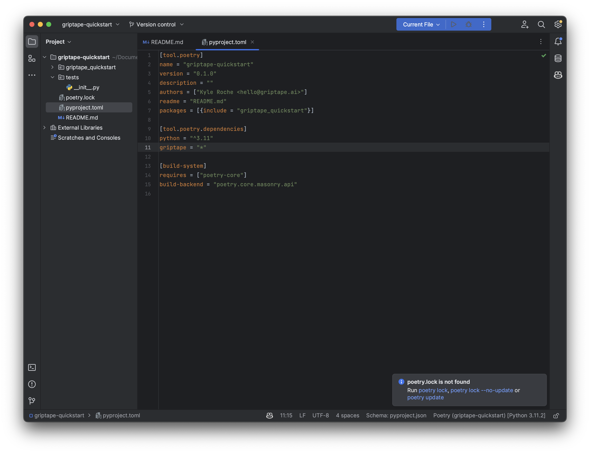

Tools give the LLM abilities to invoke outside APIs, reference data sets, and generally expand their capabilities. Official Griptape tools for the [Griptape Framework](https://github.com/griptape-ai/griptape). You can run Griptape tools in **griptape**, [LangChain](https://github.com/hwchase17/langchain), or as [ChatGPT Plugins](https://openai.com/blog/chatgpt-plugins).

## Quick Start

### Using PIP
1. Install **griptape**
```
pip install griptape -U
```
2. Copy the code below into a new file called **app.py**.
3. Set an env variable called `OPENAI_API_KEY` or replace the variable in the code snippet for testing. 
4. Run the app

### Using Poetry
To get started with **griptape** using poetry first create a new poetry project from the terminal: 

```
% poetry new griptape-quickstart
Created package griptape_quickstart in griptape-quickstart
```

If you're using PyCharm, open the directory and you'll be prompted to setup the Poetry environment. 


Add `griptape = "*"` to your **pyproject.yml** file. You should notice PyCharm asking if it should run `poetry update`. The answer is yes.

 

Right click on your project and select *New* -> *Python File*. Call it **app.py**. Copy the code below into **app.py**
```py
from decouple import config
from griptape.core import ToolLoader
from griptape.drivers import OpenAiPromptDriver, MemoryStorageDriver
from griptape.executors import LocalExecutor
from griptape.memory import Memory
from griptape.ramps import StorageRamp
from griptape.structures import Pipeline
from griptape.tasks import ToolkitTask, PromptTask
from griptape.tools import WebScraper

storage = StorageRamp(
    driver=MemoryStorageDriver()
)

scraper = WebScraper(
    ramps={
        "get_content": [storage]
    }
)

pipeline = Pipeline(
    memory=Memory(),
    tool_loader=ToolLoader(
        tools=[scraper],
        executor=LocalExecutor()
    )
)

pipeline.add_tasks(
    ToolkitTask(
        tool_names=[scraper.name]
    ),
    PromptTask(
        "Say the following in spanish: {{ input }}"
    )
)

result = pipeline.run("Give me a summary of https://en.wikipedia.org/wiki/Large_language_model")

print(result.output.value)
```

You should see a final result similar to the following: 

```
Q: Give me a summary of https://en.wikipedia.org/wiki/Large_language_model
[chain of thought output... will vary depending on the model driver you're using]
A: Los modelos de lenguaje de gran tamaño son herramientas utilizadas para tareas de procesamiento del 
lenguaje natural, como detectar falsedades, completar oraciones y comprender el lenguaje. Algunos modelos 
notables incluyen BERT, GPT-2, GPT-3, GPT-Neo y GLaM. The Pile es un conjunto de datos extenso utilizado 
para el modelado del lenguaje. Estos modelos han sido desarrollados e investigados en trabajos como TruthfulQA, 
HellaSwag y BERT: Pre-entrenamiento de transformadores bidireccionales profundos para la comprensión del lenguaje.
```
